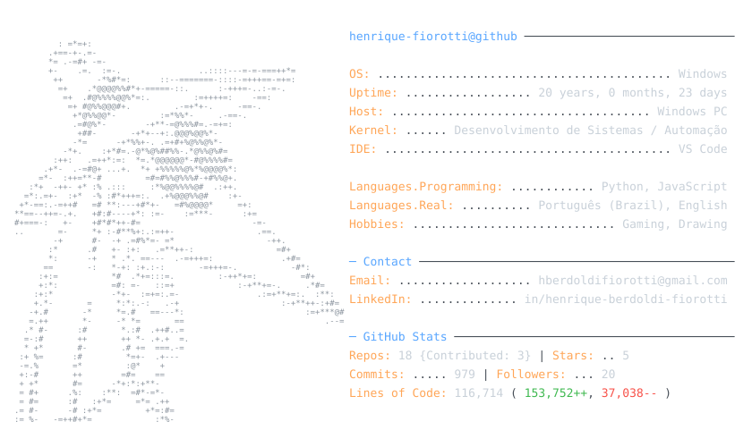

<picture>
  <source media="(prefers-color-scheme: dark)" srcset="dark_mode.svg">
  <source media="(prefers-color-scheme: light)" srcset="light_mode.svg">
  
</picture>

  <a href="https://github.com/Henrique-Fiorotti/orbis">orbis</a> ·
  <a href="https://github.com/Henrique-Fiorotti/atv-paivs-techrent">atv-paivs-techrent</a>

